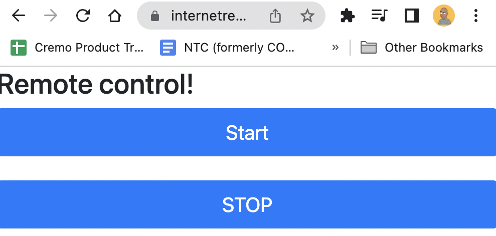

How often have we wanted to control something over the internet (a smartphone app, or a simple web page). Sure Google Home and Alexa and control practically any commercial off the shelf project, but where is the fun in that. 

As a maker, would you want to create something that allows you to control something as simple as a light (lets start with an LED light, and progress from there). 

For most users getting into electronics, one of the first projects that they do, is controlling an LED with a battery, to get a basic undertanding of the circular circuit). Sommething like this


What we are attempting to do, is just a minor variation of #2. We would control the switch off the internet, with a simple webpage, with basic controls. From a framework standpoint, the objective would be to make the same as flexible as possible, with the ability to add as many controls (E.g. up, down), for any number of applications (robotics, fans etc). 

But for now, all we care about, is a "start" and a "stop" options. 

So here goes. 

We have aimed to keep the setup as simple as possible, something that enables us to get started in 10-15 mins max with the required setup as well as wiring. 

Hardware
1. Raspberry Pi 4 Model B with 4GB memory

Software
1. Thonny as the IDE (default choice on the Pi)
2. replit as the server (chose replit because of its free plan, and 0 setup cost of infra, specially for toy projects)
3. The server on Replit was essentially a flask on python

Lets start with the ONLY difference of this project from a typical light switch one. The remote (start.html within templates).  
```Two buttons, controlling the 2 actions, making an AJAX call on selection
<button class="btn btn-primary btn-lg btn-block" onclick="UpdateStatus('start')">Start</button> <br>
<button class="btn btn-primary btn-lg btn-block" onclick="UpdateStatus('stop')">STOP</button><br>
```
	
The ajax call also does nothing overly spectacular, it just writes the user selected option within a file (NOTE: This is a toy project, this would definitely. need a security setup, and a more scalable model if you plan to make this production ready
```<script>
      function UpdateStatus(Status)
      {
   
        var xhttp = new XMLHttpRequest();
        xhttp.onreadystatechange = function() {
            if (this.readyState == 4 && this.status == 200) {
               // Typical action to be performed when the document is ready: E.g. window.alert("done")
            }
        };
        xhttp.open("GET", "/buttonclick?function=" + Status, true);
        xhttp.send();
      }
    </script>
```

The dynamic part of the server, also just has 3 main functions
1. Load the main page (statif remote)
2. Change the control (called when the user selects a remote option)
3. get the control action (fetched from the pi)

```from flask import Flask, render_template, request
app = Flask('app')

@app.route('/')
def main_remote_page():
  return render_template('start.html')

@app.route('/buttonclick')
def button_click():
  name = request.args.get("function")
  f = open("file.txt", "w")
  f.write(name)
  f.close()
  return "file is written"

@app.route('/getcontrol')
def get_control():
  f = open("file.txt", "r")
  ret = f.read()
  f.close()
  return ret
```

So basically, to reiterate
1. The flask action shows up the remote to the user, which at a very crude level looks something like this

3. On selecting any option, the same is written onto the server local filesystem
4. That is constantly pinged by the Raspberry client, which them decides whether to keep the light on or off. 

Thats about it. 
